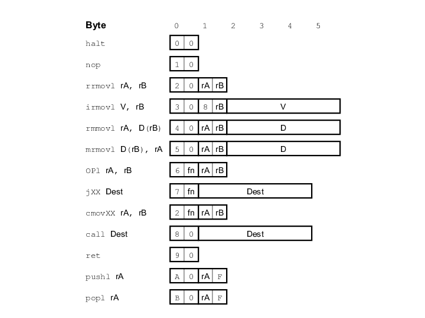
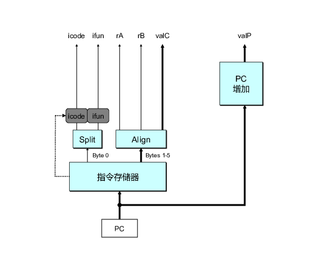
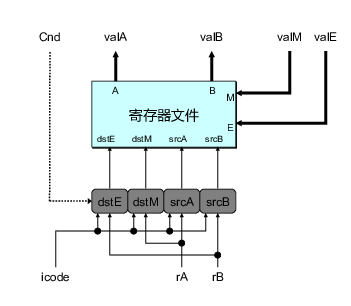
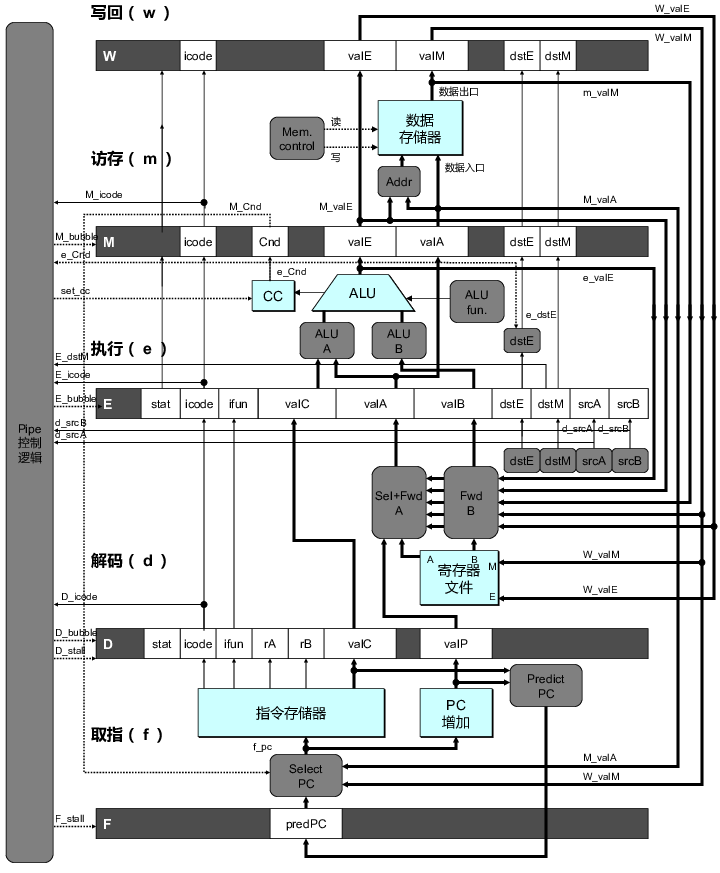
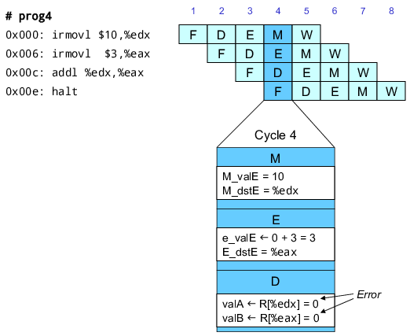
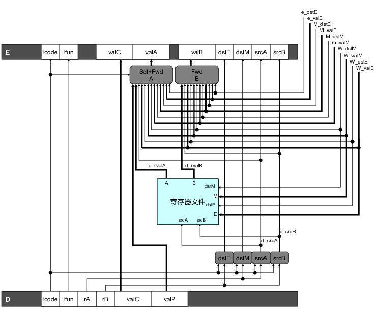
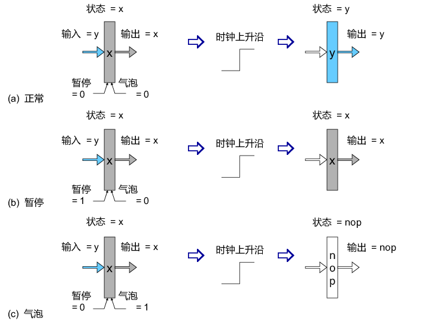
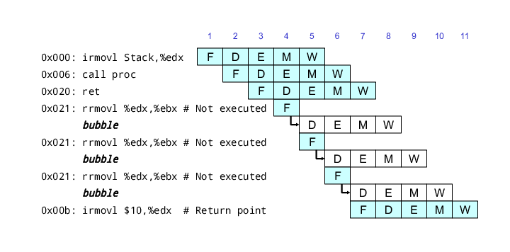
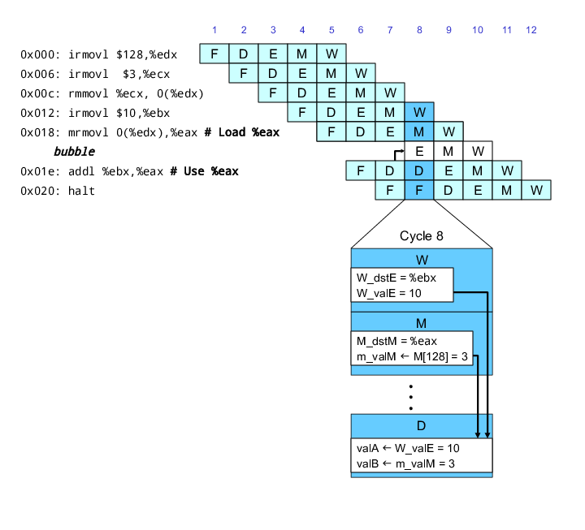
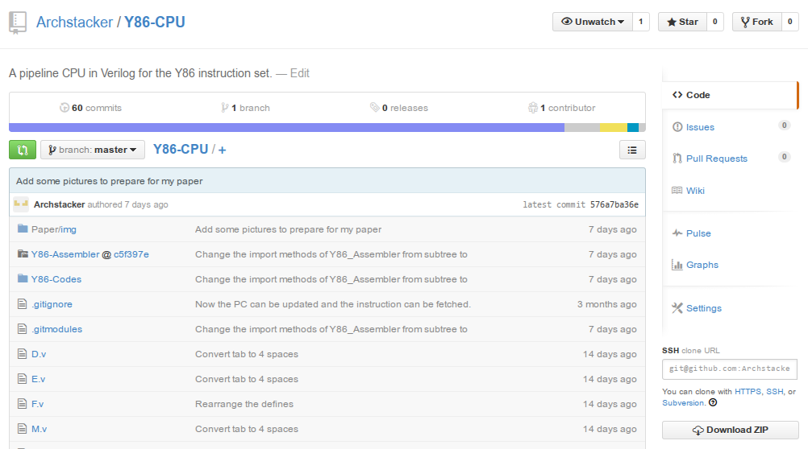

 支持Y86指令集CPU的设计与实现

* **编程语言：** 
Verilog

* **实验环境：** 
Modelsim

* **参考书籍：** 
《自己动手写CPU》
《Computer Systems A Programmer's Perspective(Second Edition)》

* **CPU基本情况**
实验制作的CPU为五级流水线，能够读取Y86汇编对应的十六进制数并得出相应的结果。CPU采用冯·诺依曼结构，程序指令存储器和数据存储器合并在一起。

# Y86指令集架构

## 基本变量
CPU中共有8个32位的程序寄存器，指示指令的PC的长度也为32位，故程序支持最大4G的内存。CPU还有三个标志位，分别是零标志zf、符号标志sf、溢出标志of，这三个标志位统称为CC。


## Y86指令

Y86共有12类指令，长度在1字节到6字节不等。每条指令都至少有一个自己的标志位，还可能有1个字节指示使用的寄存器，4个字节来代表立即数。



## 指令编码

每条指令的第一个字节的前半部分为code字段，其值从0到B共12个，标记该指令的类型，后半部分是function字段，一般的指令改字段为0，但在操作、分支、移动指令中，该字段用来区分这条指令的具体功能。


很多指令都会有一个字节用来表示所用到的寄存器。每个寄存器都用一个数字来表示，使用RNONE（0xF）代表没有用到寄存器。


有些指令会有四个字节的立即数，立即数在指令中以小端模式存储。

## Y86汇编

直接写Y86的机器代码，不仅很麻烦，而且容易出错。对日常使用的那些汇编指令集，可以先写汇编代码，然后由汇编器转成机器代码。

对于X86汇编语言来说，有nasm、masm等汇编器，而对于这里用到的Y86汇编语言，也有相应的汇编器yas。通过yas，可以将Y86汇编转成机器代码。

下面是一个Y86转成机器代码的实例：

```
                      | /* $begin code-yso */
                      | /* $begin code-ysa */
                      | # Execution begins at address 0 
  0x000:              | 	.pos 0 
  0x000: 30f400010000 | init:	irmovl Stack, %esp  	# Set up stack pointer  
  0x006: 30f500010000 | 	irmovl Stack, %ebp  	# Set up base pointer   
  0x00c: 8024000000   | 	call Main		# Execute main program
  0x011: 00           | 	halt			# Terminate program 
                      | 
                      | # Array of 4 elements
  0x014:              | 	.align 4 	
  0x014: 0d000000     | array:	.long 0xd
  0x018: c0000000     | 	.long 0xc0
  0x01c: 000b0000     | 	.long 0xb00
  0x020: 00a00000     | 	.long 0xa000	
                      | 
  0x024: a05f         | Main:	pushl %ebp 
  0x026: 2045         | 	rrmovl %esp,%ebp
  0x028: 30f004000000 | 	irmovl $4,%eax	
  0x02e: a00f         | 	pushl %eax		# Push 4
  0x030: 30f214000000 | 	irmovl array,%edx
  0x036: a02f         | 	pushl %edx      	# Push array
  0x038: 8042000000   | 	call Sum		# Sum(array, 4)
  0x03d: 2054         | 	rrmovl %ebp,%esp
  0x03f: b05f         | 	popl %ebp
  0x041: 90           | 	ret 
                      | 
                      | /* $begin sum-ys 0 */
                      | 	# int Sum(int *Start, int Count)
  0x042: a05f         | Sum:	pushl %ebp
  0x044: 2045         | 	rrmovl %esp,%ebp
  0x046: 501508000000 | 	mrmovl 8(%ebp),%ecx 	# ecx = Start
  0x04c: 50250c000000 | 	mrmovl 12(%ebp),%edx	# edx = Count
  0x052: 6300         | 	xorl %eax,%eax		# sum = 0
  0x054: 6222         | 	andl   %edx,%edx	# Set condition codes
  0x056: 7378000000   | 	je     End
  0x05b: 506100000000 | Loop:	mrmovl (%ecx),%esi	# get *Start
  0x061: 6060         | 	addl %esi,%eax          # add to sum
  0x063: 30f304000000 | 	irmovl $4,%ebx          # 
  0x069: 6031         | 	addl %ebx,%ecx          # Start++
  0x06b: 30f3ffffffff | 	irmovl $-1,%ebx	        # 
  0x071: 6032         | 	addl %ebx,%edx          # Count--
  0x073: 745b000000   | 	jne    Loop             # Stop when 0
  0x078: 2054         | End:	rrmovl %ebp,%esp
  0x07a: b05f         | 	popl %ebp
  0x07c: 90           | 	ret
                      | /* $end sum-ys 0 */
                      | 
                      | # The stack starts here and grows to lower addresses
  0x100:              | 	.pos 0x100		
  0x100:              | Stack:	 
                      | /* $end code-ysa */
                      | /* $end code-yso */
```

其中，冒号左边是汇编指令的地址偏移，冒号与竖线之间是CPU所能读取的机器指令，竖线右边的是原始的Y86汇编代码。


# 指令分段及相应硬件结构

为了充分利用CPU资源，便于CPU流水作业，我们需要将指令进行分段，对每一段有相应的硬件进行操作。

## 指令分段

* **取指（fetch）** 
从存储器中，从PC值所指示的位置开始读取6字节的数据。根据第一个字节中的icode（指令代码）决定该命令各字节代表的意义，并依情况读取所要操作的寄存器操作数或立即数，同时根据指令决定下一次取指时的PC值，确定回写时要操作的寄存器。

* **译码（decode）** 
主要是向寄存器发信号，读取rA、rB对应的寄存器的值，赋到valA与valB中。

* **执行（execute）** 
对数据进行运算，同时确定标志位CC的值及决定是否需要跳转的Cnd位。

* **访存（memory）**
 与存储器进行操作，从存储器中读取数据或向存储器中写入数据。

* **写回（write back）** 
将操作结果写入最多两个到寄存器。

按上面的标准对每条指令进行细分的话可以得到以下几个表

 Computations in sequential implementation of Y86 instructions 

通过上面对指令执行过程中阶段的划分及各指令具体执行情况，可以确定各阶段的硬件结构。

## 硬件结构

### 取指阶段



我们根据PC从内存中取到数据之后，将第一个字节拆分成icode和ifun两个半字节数，同时根据icode对后面5个字节进行拆分、整理，得到rA、rB或valC的值，如果没有对应的值的话，将其值赋为RNONE，同时根据icode决定的该指令的长度确定下条指令取指时的PC值。

### 译码和写回阶段



这两个阶段主要是与寄存器文件进行处理，其中译码阶段通过srcA和srcB确定要读取的寄存器，并将读取到的数据赋值给valA和valB，而写回阶段通过dstM和dstE确定要写回的寄存器，将valM和valE写入到相应的寄存器。

### 执行阶段


执行阶段要根据指令的类型确定所要进行的操作（加、减、与、异或）以及是否要设置标志位，对两个输入的值来进行运算，并根据计算情况得到标志位CC和决定是否需要跳转的Cnd。

由之前指令分段的具体情况可以看出，除了OPl指令意外，其他的指令所需要的运算都可以归结为加法操作。并且在我们的CPU设计中，只有OPl的操作会改变CC的值，故当指令为OPl时se令t_cc=1，以便ALU根据情况设置CC的值。

### 访存阶段


访存阶段主要是根据指令类型决定是要从内存中读数据还是向内存中写数据。如果要从内存中读数据的话，则有mem_read=1，从mem_addr这个内存地址读取4字节的数据赋给valM，如果要向内存中写程序的话，则将mem_data的值写入从mem_addr地址开始的4字节的位置。

# 流水线的实现


## 要解决的问题

实现流水线，面临的比较大的三个问题是数据冒险、控制冒险、结构冒险。

### 数据冒险
指令按照流水线执行时，可能会发生读取数据与写入数据之间的时序与空间的相关性，成为数据冒险。如果不加以处理，可能会出现错误。如果指令乱序执行时，有3种可能的数据冒险：

* 写后读（RAW）
* 读后写（WAR）
* 写后写（WAW）

但在本CPU中，已经将各指令进行了分段，读取寄存器只会发生在译码阶段，修改寄存器只会发生写回阶段，读取和修改内存只会在访存阶段且不会在一条指令中，故后一条指令对寄存器或内存的写操作一定在前一条指令的对相应结构读操作或写操作后面，故读后写和写后写两种冲突不可能出现。故着重需要解决的是写后读这种数据冒险。

对于这种情况，主要通过数据前推来实现。对于一些通过数据前推无法解决的，再通过加入气泡来实现。

### 控制冒险

指令流水时，处理器遇到分支指令，不能在流水开始阶段就判断出分支结果。

对于这种情况，通过分支预测来解决，其中也会用到数据前推。

### 结构冒险

主要是一个存储单元被一条指令取操作数同时另一条指令要写入结果。

对于这种情况，本身很难去解决。但是如果在编程的时候能够划分为代码段和数据段，保证程序本身不会修改代码，便不会出现这种问题。

## 硬件结构

为了实现数据前推、分支预测、插入气泡，就必须让硬件结构与之相适应，加强个模块之间的联系。最终的硬件结构如下：



其中，标号为F、D、E、M、W五个阶段为时序逻辑电路部分，用来对上一层得到的结果在下一个时钟周期到来时传递给下一层。这五个阶段之间夹的是取指、译码、执行、访存四个组合逻辑电路，分布计为f、d、e、m，这是CPU具体操作的部分。

寄存器文件用来存储寄存器的值，数据寄存器用来存储指令、数据。图中还有数据前推模块和分支预测模块，这将在接下来具体说明。

## 具体实现

### 数据前推

考虑如下指令：

```
0x000:irmovl $10,%ebx
0x006:irmovl  $3,%eax
0x00c:addl %ebx,%eax
0x00e:halt
```

当addl命令在译码阶段，需要从寄存器文件中取到寄存器ebx和eax的值来进行下一步的操作。而此时第一条指令才到访存阶段，第二条指令才到执行阶段，还没有更新寄存器文件，引起addl取不到正确的寄存器值，也即上面说的“写后读”数据冒险。



对于这种情况，我们可以通过在addl前面加入三个气泡，也即等到前面两条条指令都写回阶段更新寄存器的值之后再进行译码，取得正确的寄存器的值。

但有趣的是，指令irmovl最终要修改的寄存器的值在执行阶段就已经可以确定，只不过需要再过几个时钟周期的传递才能送入寄存器文件。也就是说，在第三条指令进行译码的时候，在时间上它所需要的两个操作数的值已经生成了。因此我们可以通过数据前推的方式，在译码阶段查看目前处于执行、访存、写回阶段最终要写人到的寄存器及其值，如果有需要的值的话就直接取过来。

最终写回到寄存器的值主要由两个途径生成。一是在执行阶段计算出结果的valE值，最终写入dstE指示的寄存器，二是在访存阶段获取的valM值，最终写人dstM指示的寄存器。因此我们需要前推的是执行、访存、写回阶段的valE、dstE与访存、写回阶段的valM、dstM。结合CPU的硬件结构，为了实现数据前推实现为：



###分支预测

CPU需要根据PC值获取要执行指令在内存中的地址，获取指令之后才能进行译码、执行、访存、写回等操作。如果不需要实现流水线，CPU可以在实现一条指令之后再计算下个PC值。但为了实现流水线，就必须在读取一条指令之后便得到下一条指令的PC值，也就要求将更新PC阶段从回写之后调至取指之前。

对于指令不改变PC值，这点还是很容易完成的，只需要通过指令类型得到指令的长度进而由当前PC值得到下次的PC值。

但是三个控制跳转的指令，jXX、call和ret是有可能会改变程序的PC值实现程序跳转的。其中，jmp、call、ret指令如果能执行到一定会跳转，jXX中除jmp之外的指令是否跳转是根据CC标志位来的，有可能跳转也有可能不跳转。

对于那些有可能跳转也有可能不跳转的，我们固然可以通过加入气泡的方法等待确定是否确定跳转后再更新PC值获取下一条指令，但这样会白白浪费几个周期。我们可以预测跳转是否会执行，根据预测执行接下来的命令。当能决定是否要跳转时，如果发现之前预测错误再退回从新的位置开始，如果之前预测对了，就白赚了几个周期。预测的方式主要有总是预测会执行（AT），从来不预测会执行（NT），向后跳转的指令预测会执行、向前跳转的指令预测不会执行（BTFNT）几种，经过统计分析发现这几种预测的正确率分别约为60%、40%、65%。这里我们是采用的总是预测会执行的策略。

因为call一定会跳转，按照预测jXX也一定会跳转，因此在更新PC的时候，对正常的指令都是通过在取指阶段通过当前PC值加上指令的长度获得下条指令的PC值valP，而对call和jXX两类指令来说更新的PC值的地址即为改指令中的立即数代表的地址。

为了能在得知预测结果不正确之后第一时间将PC值更新，需要使用与数据前推类似的方式将当前访存状态代表是否跳转的Cnd值传至选择PC处，根据判断进行PC值的更新。

### 特殊情况处理

上面所说的数据前推以及分支预测可以解决一些流水线中的问题，但是有些特殊情况仅用这两种方法是不能处理的。

特殊情况有：

* **处理ret指令** ret指令一定会改变PC的值，但是要改变成的值要在访存阶段才能确定。而jXX和call要改变PC的值在取指阶段就能确定，这就是ret命令很难处理的地方。同时，由于ret指令肯定会跳转，因此后面紧跟着的指令就不需要执行了。
* **数据冒险** 虽然通过数据前推的方式可以解决一些写后读的问题，但是还是有些情况无法解决。
* **预测错误的分支** 上面使用了分支预测的技术，要能保证得到预测错误的结果后预测执行的那些语句能被从流水线中清除，不会对程序产生影响。

这些特殊情况的触发条件分别为：

情况  | 触发条件
------------- | -------------
处理ret指令  | IRET ∈ \{D_icode, E_icode, M_icode\}
数据冒险  | E_icode ∈ \{IMRMOVL, IPOPL\} && E_dstM ∈ \{d_srcA, d_srcB\}
预测错误的分支 | E_icode = IJXX && !e_Cnd

解决特殊指令的方法是在流水线中加入暂停或者气泡。其中，暂停意味着该阶段的输出与该阶段的输入相同，气泡意味着该阶段输出空指令。如图所示：



#### 处理ret指令

当从译码阶段开始检测到ret指令在之后，要保持ret之后的指令都在寄存器里面暂停，直到访存阶段获取到ret要修改PC的值后，更新指令。

在流水线中的表示如下图：



#### 数据冒险

指令mrmovl和popl只有在访存阶段才能确定最终的寄存器的值，而如果接下来的一条指令就需要在译码阶段获取该寄存器的值的话，单单通过数据前推是无法实现的，必须暂停流水线,直至寄存器要修改的值从内存中取出。

在流水线中的表示如下图：



#### 错误的分支预测

在前面提到了，为了提高流水线效率，对不确定是否需要跳转的分支进行了预测，预测这条跳转指令会执行，进而执行跳转后地址的指令。但如果在执行阶段发现本不应该跳转，就应该将流水线中错误跳转的语句除去，换成新的地址对应的代码。

非常令人高兴的是，由于我们对指令进行了分段，而在前两个阶段（取指和译码）阶段不会修改全局变量的值，在执行阶段就可以确定跳转指令是否正确执行。因此，只需要在发现分支预测错误之后将前面两个阶段变为气泡就可以了。

根据以上分析，可以得到以下代码：

```verilog
F_stall_o   <=      ( E_icode_i==`IMRMOVL || E_icode_i==`IPOPL )&&
                    ( E_dstM_i==d_srcA_i || E_dstM_i==d_srcB_i ||
                        E_dstE_i==d_srcA_i || E_dstE_i==d_srcB_i )||
                    ( D_icode_i==`IRET || E_icode_i==`IRET || M_icode_i==`IRET );

D_stall_o   <=      ( E_icode_i==`IMRMOVL || E_icode_i==`IPOPL )&&
                    ( E_dstM_i==d_srcA_i || E_dstM_i==d_srcB_i ||
                        E_dstE_i==d_srcA_i || E_dstE_i==d_srcB_i );

D_bubble_o  <=      ( E_icode_i==`IJXX && !e_Cnd_i )||
                    !(( E_icode_i==`IMRMOVL || E_icode_i==`IPOPL )
                        &&( E_dstM_i==d_srcA_i || E_dstM_i==d_srcB_i ||
                            E_dstE_i==d_srcA_i || E_dstE_i==d_srcB_i ) )
                    &&( D_icode_i==`IRET || E_icode_i==`IRET || M_icode_i==`IRET );

E_bubble_o  <=      ( E_icode_i==`IJXX && !e_Cnd_i )||
                    ( E_icode_i==`IMRMOVL || E_icode_i==`IPOPL )&&
                    ( E_dstM_i==d_srcA_i || E_dstM_i==d_srcB_i ||
                        E_dstE_i==d_srcA_i || E_dstE_i==d_srcB_i );

```

# CPU程序验证

首先是上面的求和程序，主要就是通过循环算出数组
```
  0x014: 0d000000     | array:	.long 0xd
  0x018: c0000000     | 	.long 0xc0
  0x01c: 000b0000     | 	.long 0xb00
  0x020: 00a00000     | 	.long 0xa000	
```
所有元素之和。

这里只给出程序运行的最终结果：


同时，我还编写了以下计算两个寄存器中无符号的16位的值的乘法并将结果赋给一个寄存器的Y86汇编代码，使用的乘法算法为最简单的定点原码一位乘法。程序如下：

```
                      | /* $begin code-yso */
                      | /* $begin code-ysa */
                      | # Execution begins at address 0
  0x000:              |     .pos 0
  0x000: 30f400010000 | init:   irmovl Stack, %esp      # Set up stack pointer
  0x006: 30f500010000 |     irmovl Stack, %ebp          # Set up base pointer
  0x00c: 8012000000   |     call Main                   # Execute main program
  0x011: 00           |     halt                        # Terminate program
                      | 
  0x012: a05f         | Main:   pushl %ebp
  0x014: 2045         |     rrmovl %esp,%ebp
  0x016: 30f0dd020000 |     irmovl $733,%eax
  0x01c: a00f         |     pushl %eax                  # Push 733
  0x01e: 30f21b010000 |     irmovl $283,%edx
  0x024: a02f         |     pushl %edx                  # Push 283
  0x026: 8030000000   |     call Mul                    # Mul( 283, 733 )
  0x02b: 2054         |     rrmovl %ebp,%esp
  0x02d: b05f         |     popl %ebp
  0x02f: 90           |     ret
                      | 
                      | /* $begin mul-ys 0 */
                      |     # int Mul(int num1, int num2)
  0x030: a05f         | Mul:    pushl %ebp
  0x032: 2045         |     rrmovl %esp,%ebp
  0x034: 501508000000 |     mrmovl 8(%ebp),%ecx         # ecx = num1
  0x03a: 50250c000000 |     mrmovl 12(%ebp),%edx        # edx = num2
  0x040: 6300         |     xorl %eax,%eax              # result = 0
  0x042: 30f601000000 |     irmovl $1,%esi              # bit = 1
  0x048: 30f3ffff0000 | Loop:   irmovl $65535,%ebx      # ebx = 0xffff
  0x04e: 2067         |     rrmovl %esi,%edi            #
  0x050: 6217         |     andl %ecx,%edi              # result & bit
  0x052: 735b000000   |     je Next
  0x057: 6020         |     addl %edx,%eax              # result = result + num2
  0x059: 6161         |     subl %esi,%ecx              # num1 = num1 - bit
  0x05b: 6066         | Next:   addl %esi,%esi          # bit *= 2
  0x05d: 6022         |     addl %edx,%edx              # num2 *= 2
  0x05f: 6213         |     andl %ecx,%ebx
  0x061: 7448000000   |     jne    Loop                 # Stop when 0
  0x066: 2054         | End:    rrmovl %ebp,%esp
  0x068: b05f         |     popl %ebp
  0x06a: 90           |     ret
                      | /* $end mul-ys 0 */
                      | 
                      | # The stack starts here and grows to lower addresses
  0x100:              |     .pos 0x100
  0x100:              | Stack:
                      | /* $end code-ysa */
                      | /* $end code-yso */
```

下面我结合modelsim的仿真情况，对程序执行中实现上面算式过程的乘法核心代码：

```
  0x057: 6020         |     addl %edx,%eax              # result = result + num2
  0x059: 6161         |     subl %esi,%ecx              # num1 = num1 - bit
  0x05b: 6066         | Next:   addl %esi,%esi          # bit *= 2
  0x05d: 6022         |     addl %edx,%edx              # num2 *= 2
  0x05f: 6213         |     andl %ecx,%ebx
```

过程中寄存器变化情况进行说明。

开始时，eax为0，存放到目前为止的结果，ecx为num1，edx为num2。从ecx按位从后往前判断，如果该位为1，则eax加上ecx的值，同时ecx该位置零以便进行是否还需要运算的判断。每判断ecx的一位，edx变为原来的而被，作为如果ecx该位为0其乘num2的结果。

在本程序中，两个操作数分布为733和283，转为十六进制为0x2dd和0x11b，转为二进制数为1011011101和100011011，乘法的实现过程如下：

```
          1011011101 =   0x2dd
         ×0100011011 =   0x11b
 ———————————————————
          1011011101 =   0x2dd
        +1011011101  =   0x5ba
 ———————————————————
        100010010111 =   0x897
      +1011011101    =  0x16e8
 ———————————————————
       1111101111111 =  0x1f7f
     +1011011101     =  0x2dd0
 ———————————————————
     100110101001111 =  0x4d4f
 +1011011101         = 0x2dd00
 ———————————————————
  110010101001001111 = 0x32a4f
```

通过跟踪eax的变化过程我们可以得到这个过程的实现过程如下：


发生在620000ps处。首先判断一下ecx的最低位，发现为1，则在黄线处将edx，也即num2的值加到eax中。在鼠标处可以看到，ecx将最低位置零，其值从0x11b变为0x11a。在图中的最后，edx变为原来的二倍，即其值从开始的0x2dd变为0x5ba。


距上次判断0x240000ps处，第二次判断ecx的倒数第二位，发现还是一，于是情况和上面相同，黄线处eax变为0x2dd+0x5ba=0x897，在鼠标处ecx从0x11a变为0x118，edx从0x5ba变为0xb74。


第三次判断到ecx的当前位不为1，eax不改变。第四次判断到ecx的当前位为1，此时的edx已不是上面图中的0xb74，而变成的其二倍0x16e8。故eax在黄线处变为0x897+0x16e8=0x1f7f。ecx从0x118变为0x110，edx从0x16e8变为0x2dd0。


第四次判断与上面几次类似，eax变为0x4d4f，ecx变为0x100,edx变为0x5ba00。


因为接下来几次ecx都不为1，所以流水线一直走了很长时间。直到程序快要结束，终于发现ecx该位为0，此时edx已变为0x2dd00。eax变为0x4d4f+0x2dd00=0x32a4f，ecx清除当前位后变成0，说明该循环结束。紧接着，CPU将会跳出子程序，进而在主函数中实现停机指令。

# 实验感想

## 主要背景
以前仅仅大概了解了一下Verilog，这次就直接做CPU，确实跨度有点大。但多谢《自己动手写CPU》这本书，通过这本书我知道了应该如何下手。不过到现在还是我还是有些基本的与的电路相关东西不是很了解。

我这次做的CPU是参照CSAPP2e的第四章来的，尽可能用Verilog还原书中的CPU，变量名及系统结构都尽量跟书上保持一致。不得不说，看到CSAPP这本神书真的是让我相见恨晚。当时看第四章的时候感觉书上写的太虚，远没有书的前几章浅显易懂。不过，当我真正跟着书上所说的去做CPU的时候，才发现书上所讲的全都是踏踏实实的，基本都能用得到。虽然书上没有任何Verilog代码实现，但是对我写程序帮助极大，也正是这本书让我能够一点一点实现五级流水线的CPU。

如果跟CSAPP书上的内容相比，我感觉本次做CPU并没有多少创新之处。但是我感觉自己瞎想实现一个简单的模型和通过深入的学习系统了解方式方法相比，了解比实现更能提高一个人。这也是通过开源的魅力所在吧：如果你仅仅是自己写代码，你可能永远不会有太大突破。仅有你仔细阅读其他人的代码，才能在巨人的肩膀上更进一步。

## 版本控制

本次实验中，我第一次尝试了使用git来管理代码，进行版本控制。本次实验持续时间长，代码前后改动非常大，使用git管理能让我很清楚的知道上次都修改了什么，错误都是在哪出的，我都做出来什么改进，同时，在这个过程中，我也根据实际情况尝试了很多git的功能。现在算起来，也有60多个commit了，有的修改较多，有的修改较少，现在看起来还是蛮有成就感的。这里我把commit贴出来，作为这段时间的记录吧！

```
* 3d98478 - (HEAD, master) Change some defines. Implement the conditional move instructions. (4 days ago) <ArchStacker>                                                 
* 576a7ba - (origin/master, origin/HEAD) Add some pictures to prepare for my paper (7 days ago) <ArchStacker>                                                           
* 69ccf7a - Change the import methods of Y86_Assembler from subtree to submodule.Change the name of directories. (7 days ago) <ArchStacker>                             
* 97cc2b7 - Remove the unused variable. (7 days ago) <ArchStacker>                                                                                                      
* a0aaa63 - Add the simple support for halt (13 days ago) <ArchStacker>                                                                                                 
* 73a88fc - Rearrange the defines (2 weeks ago) <ArchStacker>                                                                                                           
* dd36d73 - Convert tab to 4 spaces (2 weeks ago) <ArchStacker>                                                                                                         
* c1b9456 - Change the names of files which were modified in the previous commit except for y86cpu.v (2 weeks ago) <ArchStacker>                                        
* 1ee884b - Change names of variables from id_ex.v to mem_wb.v and y86cpu.v according to Figure 4.52 in the CSAPP (2 weeks ago) <ArchStacker>                           
* 0eca099 - Delete the old test data.Change the README.md (2 weeks ago) <ArchStacker>                                                                                   
* 0c3a247 - Add a Y86 assembly code program to compute the result of multiplication with two numbers (3 weeks ago) <ArchStacker>                                        
* 0738499 - Change the yas.py to generate the data that can be readed (3 weeks ago) <ArchStacker>                                                                       
* c68ca39 - Add examples of Y86 assembly code programs used in Chapter 4 of CS:APP2e (3 weeks ago) <ArchStacker>                                                        
*   52a05d3 - Merge commit '8b94ac244c01df21f21b61d216880c8ee96564bc' as 'Y86_Assembler' (3 weeks ago) <ArchStacker>                                                    
|\                                                                                                                                                                      
| * 8b94ac2 - Squashed 'Y86_Assembler/' content from commit 0c9e81c (3 weeks ago) <ArchStacker>                                                                         
* befd02a - Change the endianness from big endian to little endian (3 weeks ago) <ArchStacker>                                                                          
* 7f7a74b - Change the 4-bit size define from BYTE to NIBBLE.Now a BYTE contains 8 bits (3 weeks ago) <ArchStacker>                                                     
* c67133a - Add the support for ret. Fix many bugs to run the full fugure 4.8 code while the data is in big endian. (3 weeks ago) <ArchStacker>                         
* bd87124 - Add pipe_control_logic.v. Now the load/use hazards can be solved (3 weeks ago) <ArchStacker>                                                                
* 56f6c54 - Fix the bugs when completed rmmovl and mrmovl (4 weeks ago) <ArchStacker>                                                                                   
* b84b8b5 - Add the select_pc.v. Add the support for jmp (4 weeks ago) <ArchStacker>                                                                                    
* 180763c - Replace the pc_reg.v with F.v. Add the support for call (4 weeks ago) <ArchStacker>                                                                         
* 792d7da - Move id.v to f.v, if_id.v to D.v (4 weeks ago) <ArchStacker>                                                                                                
* 8c7932c - Add d.v, change names of variables in d.v id.v if_id.v according to Figure 4.52 in the CSAPP (4 weeks ago) <ArchStacker>                                    
*   1ccdefb - conflict fixed (5 weeks ago) <ArchStacker>                                                                                                                
|\  
| * d1bfb3f - Add the support for pushl and popl (5 weeks ago) <ArchStacker>
| * 7aad7c4 - Add the sel_fwd_a.v to avoiding valA hazard by forwarding.Now most pipeline hazards can be solved (5 weeks ago) <ArchStacker>
* | 5cd6d9f - Add the sel_fwd_a.v to avoiding valA hazard by forwarding.Now most pipeline hazards can be solved (5 weeks ago) <ArchStacker>
|/  
* 6587c6b - Change some variables' name (5 weeks ago) <ArchStacker>
* fe35efd - Add the fwd_b.v to avoiding valB hazard by forwarding (5 weeks ago) <ArchStacker>
* 1939904 - Remove the rA and rB port after id.v (6 weeks ago) <ArchStacker>
* 33264cc - Get the dstM value in id.v (6 weeks ago) <ArchStacker>
* a300dd1 - Get the dstE value in id.v (6 weeks ago) <ArchStacker>
* 8a05959 - Replace PCLEN with WORD (6 weeks ago) <ArchStacker>
* 3ac653c - Add the support for rmmovl and mrmovl (8 weeks ago) <ArchStacker>
* 2da51ca - Judge the dstE and dstM value in mem_wb.v. Now the rrmovl irmovl and opl instructions can work (8 weeks ago) <ArchStacker>
* b938797 - Add the icode,rA,rB ports,remove the dstE,dstM ports (8 weeks ago) <ArchStacker>
* 6e093ee - Remove the useless port in ex.v (8 weeks ago) <ArchStacker>
* 9758641 - Add the support for rrmovl (8 weeks ago) <ArchStacker>
* c308e15 - Add the support for the irmovl (8 weeks ago) <ArchStacker>
* 736fc11 - Changed the dstW port to dstE and dstM port.Add the mem_wb.v.Now the OPl can work (9 weeks ago) <ArchStacker>
* 4e180b6 - Add the mem.v (10 weeks ago) <ArchStacker>
* ec7f322 - Add dstW port (10 weeks ago) <ArchStacker>
* 358ecdc - Add the ex_mem module (2 months ago) <ArchStacker>
* 606250c - Add the ex module (2 months ago) <ArchStacker>
* 1065604 - Add the id_ex module (3 months ago) <ArchStacker>
* e706db8 - Add the regfile (3 months ago) <ArchStacker>
* 152dcb7 - Now the PC can be updated and the instruction can be fetched. (3 months ago) <ArchStacker>
* 32c4e25 - PC can be changed according to the valP (3 months ago) <ArchStacker>
* 6f91efa - Add the valC in the id.v (3 months ago) <ArchStacker>
* 39bd88f - Add the do script to automatic simulate the cpu (3 months ago) <ArchStacker>
* b9ab451 - Read six bytes from rom one time (3 months ago) <ArchStacker>
* 25b1e2d - Correct some errors to make it can be simulated (3 months ago) <ArchStacker>
* 8ff1a0b - Add the sopc (3 months ago) <ArchStacker>
* 59c5eb2 - Add the rom (3 months ago) <ArchStacker>
* 0ddcdc3 - Y86 CPU which only can fetch (3 months ago) <ArchStacker>
* cb63c3b - Add the id.v (3 months ago) <ArchStacker>
* c194a10 - Add the constant values used in HCL descriptions (3 months ago) <ArchStacker>
* aadffaf - Add the gitignore (3 months ago) <ArchStacker>
* 2d3f186 - First commit (3 months ago) <ArchStacker>
* a26bc09 - Initial commit (3 months ago) <ArchStacker>
```

既然提到了git，就不得不提GitHub了。当时刚开始做这个实验的时候我就搜了一下，GitHub上虽然有很多Y86的实验，但真正是用Verilog写的就没几个了，多是用python或C++写的。我还是比较奇怪，用这些语言是如何实现CPU的，以后有机会研究一下。本次实验的全部内容我都放到了GitHub上，不知能不能给别人提供帮助，也希望能收到别人，尤其是对电路比较熟的人的Pull Request。



## 下步期望

我在选择Y86指令集不仅是因为神书CSAPP介绍了它，更重要的是CSAPP提供了一些仿真的程序，比如比较吸引我的Y86汇编器，这样如果我做好CPU之后，我就能直接写汇编指令让机器帮我转成十六进制。同时，官方好像还有一些测试的脚本和代码，以便对我的CPU进行测试。

可惜，后来我又看了一下官方提供的文件，发现其中做CPU使用书中讲述的HCL语言做的，而我到现在也没明白这个语言是怎么表示CPU的时序关系的。同时，官方的测试脚本也是针对与HCL语言写的CPU来的，我也就没法使用。官方写的汇编器yas好复杂啊，好像还用了编译原理的一些东西，而为了汇编出我的Verilog能够读取的十六进制文件，我去将用python写的yas（linusyang/python-y86
）fork了一下。

虽然没能使用官方提供的工具，但是这次写本报告因为时间比较紧，图片多是对书中的进行修改，组织结构也参考书上的来。这也算是意料之中的福利吧！

不过，我还是希望如果有时间的话我能弄明白官方那些HCL文件的工作原理是什么，希望看懂官方C写的yas是如何实现的，如何修改它，尤其是在学过编译原理之后。同时，不知道在学过编译原理之后，能不能做一个高级语言到Y86汇编的编译器。

同时，在做CPU的过程中，我也遇到了很多问题。有些问题已经解决了，但有些问题还没得到解决，我都写到了README.md里面。其中，我能解决的，我希望能抽出来一点时间再去做做，毕竟作为我的Github上的第一个repository，虽然它对我以后的帮助不是很大，但我还是有动力使它变得更好的。对那些我解决不了的问题，就寄托与今后看到我这个repository并有兴趣有能力的人吧！
